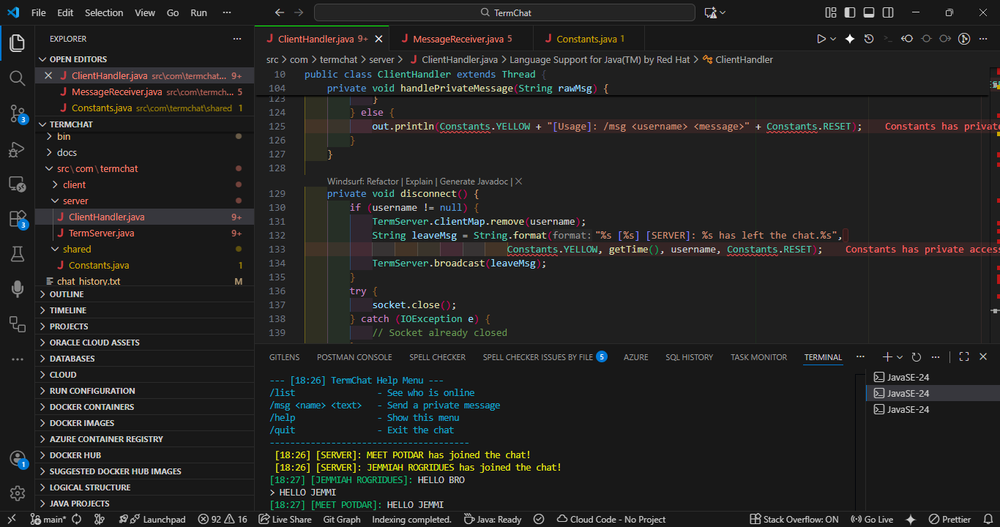

# 🚀 TermChat: Professional Multi-Threaded Terminal Chat


**TermChat** is a high-performance, socket-based communication engine designed for real-time interaction. It leverages **Java Multi-threading** to manage concurrent users, featuring a custom-built **Word Filter**, **Synchronized Logging**, and **Private Messaging** protocols—all within a sleek terminal environment.

## ✨ Features

* **Multi-User Support**: Powered by Java Multi-threading, allowing many users to chat simultaneously.
* **Private Whispers**: Use `/msg <username> <message>` to send encrypted-style private texts.
* **Smart Word Filter**: Automatically detects and censors banned words using regex-based filtering.
* **Server History Logs**: Every public message and private whisper is recorded in `chat_history.txt` with timestamps.
* **ANSI Color Styling**: A fully color-coded terminal interface for better readability and a "hacker" aesthetic.
* **Live User List**: Check who is online in real-time with the `/list` command.
* **Automated Build System**: Includes an "Ultimate Launcher" (`run.bat`) that compiles, builds JAR files, and launches the ecosystem in one click.

---

## 🛠️ Tech Stack

| Layer      | Technology                            |
|:-----------|:--------------------------------------|
| Language   | Java 17+ (Core Networking)            |
| Protocol   | TCP/IP (Transmission Control Protocol)|
| Concurrency| Java Threads & Client Handlers        |
| Data       | Java IO (Streams & Buffered Readers)  |
| Automation | Batch & Bash Scripting                |

---

## 📁 Project Structure

```bash
TermChat/
├── src/                  # Java Source Files
│   └── com/termchat/
│       ├── client/       # Client-side logic
│       ├── server/       # Server-side & Multi-threading logic
│       └── shared/       # Constants, Rules, and Word Lists
├── bin/                  # Compiled Bytecode (.class files)
├── chat_history.txt      # Automated Server Logs
├── TermChat_Client.jar   # Executable Client Application
└── run.bat               # Master Build & Launch Script
```

---

## 🎨 Command Reference

Control the terminal like a pro:

🟢 /help - View rules and the command manual.

🔵 /list - See all users currently active on the server.

🟣 /msg <name> <msg> - Send a private whisper to a user.

🔴 /quit - Safely terminate your session.

---

## 🚀 How to Run

### Windows (One-Click)
1. Navigate to the root folder.
2. Double-click `run.bat`.
3. The server will launch in a new window, and your client will start automatically.

### Manual Launch (Cross-Platform)
1. **Compile**:
   `javac -d bin src/com/termchat/shared/*.java src/com/termchat/server/*.java src/com/termchat/client/*.java`
2. **Start Server**:
   `java -cp bin com.termchat.server.TermServer`
3. **Start Client**:
   `java -cp bin com.termchat.client.TermClient`

---

* **Developer Note** : This project was designed to demonstrate advanced networking concepts including Socket Programming, Thread Pooling, and Synchronized Collections.

---

👨‍💻 Author

**Meet Potdar**
*Backend & Networking Developer*

[](https://www.linkedin.com/in/meet-potdar-04b12b290?utm_source=share&utm_campaign=share_via&utm_content=profile&utm_medium=android_app)
[](https://meet3333333333.wixstudio.com/my-site)

<p align="center">  </p>

---
*Built with ❤️ using Java Sockets & Multi-threading*
